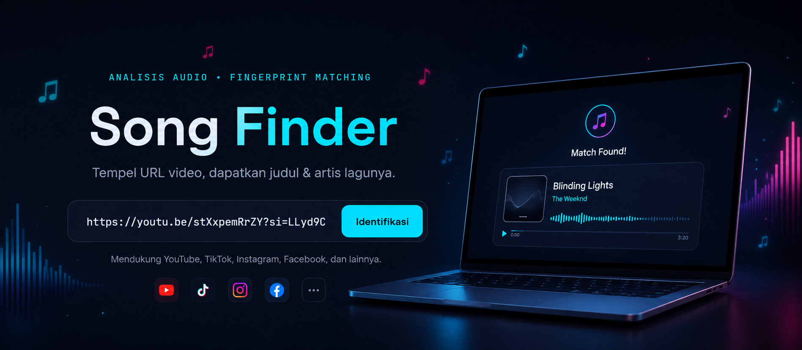

<div align="center">



[](https://www.python.org/)
[](https://flask.palletsprojects.com/)
[](#license)

</div>

## Description

**Song Finder** is a web app that identifies a song's title and artist just from a video URL. Paste a link from YouTube, TikTok, Instagram, or other platforms — the app extracts the audio, analyzes its audio fingerprint, and matches it against a song database to return the result.

Perfect for that "I found this reel with a great song but have no idea what it's called" moment.

## Table of Contents

- [Features](#features)
- [Tech Stack](#tech-stack)
- [Requirements](#requirements)
- [Installation](#installation)
- [API Keys Configuration](#api-keys-configuration)
- [Running the App](#running-the-app)
- [Project Structure](#project-structure)
- [API Reference](#api-reference)
- [Troubleshooting](#troubleshooting)
- [Limitations](#limitations)
- [Contributing](#contributing)
- [License](#license)

## Features

- **Multi-platform** — identify songs from YouTube, TikTok, Instagram, Facebook, X/Twitter, Pinterest, Snapchat, and Likee videos
- **Automatic 3-service fingerprint fallback** — AcoustID (primary) → ACRCloud → AudD, for a higher chance of finding a match
- **Modern UI** — audio/spectrogram-inspired theme with floating musical note animations
- **Localized error handling** — clear, actionable error messages
- **Stateless** — no database, no permanent storage; temporary audio files are cleaned up automatically after processing

## Tech Stack

| Layer | Technology |
|---|---|
| Backend | Flask (Python) |
| Video/Audio Extraction | `yt-dlp` + `ffmpeg` |
| Audio Fingerprinting | AcoustID (`pyacoustid`) → ACRCloud → AudD |
| Frontend | HTML, CSS (vanilla), JavaScript (vanilla) |
| Database | None (stateless by design) |

## Requirements

- **Python 3.10+**
- **ffmpeg** — must be callable from the command line (available in PATH)
- **chromaprint (`fpcalc`)** — binary for generating audio fingerprints, required by AcoustID

### Installing ffmpeg

| OS | Command |
|---|---|
| Windows (winget) | `winget install ffmpeg` |
| Windows (choco) | `choco install ffmpeg` |
| macOS (Homebrew) | `brew install ffmpeg` |
| Ubuntu/Debian | `sudo apt install ffmpeg` |

Verify: `ffmpeg -version`

### Installing chromaprint (fpcalc)

| OS | Command |
|---|---|
| Windows (choco) | `choco install chromaprint` |
| macOS (Homebrew) | `brew install chromaprint` |
| Ubuntu/Debian | `sudo apt install libchromaprint-tools` |

If installing manually, download the binary from [acoustid.org/chromaprint](https://acoustid.org/chromaprint) and make sure the path to `fpcalc` is set via the `FPCALC` environment variable, or is available in PATH.

## Installation

```bash
# 1. Clone the repository
git clone https://github.com/username/song-finder.git
cd song-finder

# 2. Create a virtual environment
python -m venv venv
venv\Scripts\activate          # Windows
# source venv/bin/activate     # macOS/Linux

# 3. Install dependencies
pip install -r requirements.txt

# 4. Create a .env file (see API Keys Configuration below)
```

## API Keys Configuration

Create a `.env` file in the project root:

```env
ACOUSTID_API_KEY=your_key_here       # required — from https://acoustid.org/new-application

# Optional — for ACRCloud and AudD fallback
ACRCLOUD_HOST=identify-ap-southeast-1.acrcloud.com
ACRCLOUD_ACCESS_KEY=your_key
ACRCLOUD_ACCESS_SECRET=your_secret
AUDD_API_TOKEN=your_token            # from https://audd.io
```

| Variable | Required? | Notes |
|---|---|---|
| `ACOUSTID_API_KEY` | Yes | Primary fingerprinting service, free |
| `ACRCLOUD_HOST` / `ACRCLOUD_ACCESS_KEY` / `ACRCLOUD_ACCESS_SECRET` | Optional | Second fallback if AcoustID finds no match |
| `AUDD_API_TOKEN` | Optional | Third fallback if both previous services fail |

> At minimum, `ACOUSTID_API_KEY` must be set. Without the other keys, only AcoustID will be used (no fallback).

**Important:** never commit your `.env` file to the repository — it's already listed in `.gitignore`.

## Running the App

```bash
python app.py
```

Open **http://127.0.0.1:5000** in your browser.

## Project Structure

```
song-finder/
├── app.py                  # Flask entry point
├── extractor/
│   └── video_extractor.py  # yt-dlp + ffmpeg wrapper
├── fingerprint/
│   └── identify.py         # AcoustID → ACRCloud → AudD wrapper
├── static/
│   ├── style.css
│   ├── script.js
│   └── images/
├── templates/
│   └── index.html
├── temp/                    # Temporary audio files (auto-cleanup)
├── img/
│   └── banner.png
├── requirements.txt
├── .env                     # API keys (not committed)
└── .gitignore
```

## API Reference

### `POST /api/identify`

**Request:**
```bash
curl -X POST http://127.0.0.1:5000/api/identify \
  -H "Content-Type: application/json" \
  -d '{"url": "https://www.youtube.com/watch?v=xxxx"}'
```

**Success response (200):**
```json
{
  "status": "success",
  "song": {
    "title": "Song Title",
    "artist": "Artist Name",
    "score": 0.95
  }
}
```

**Error response:**
```json
{
  "status": "error",
  "message": "Song not found"
}
```

### Error Codes

| HTTP | Condition |
|---|---|
| 400 | Invalid URL / unsupported platform |
| 400 | Private, expired, or unavailable video |
| 404 | Song not found across all fingerprint backends |
| 500 | Failed to download or convert audio |
| 503 | Identification service unavailable (timeout/down) |

## Troubleshooting

| Issue | Common Cause | Solution |
|---|---|---|
| `ModuleNotFoundError: No module named 'yt_dlp'` | Virtual environment not activated | Run `venv\Scripts\activate` before `python app.py` |
| `fpcalc not found` | Chromaprint not installed / not in PATH | Install chromaprint, or set the `FPCALC` variable to the binary path |
| Status 400 "Video not accessible" | Video is private, expired, or region-locked | Try a different, publicly available URL |
| Status 404 "Song not found" | Song not present in AcoustID/ACRCloud/AudD database | Add fallback API keys (ACRCloud/AudD) for broader coverage |
| Slow extraction / timeout | Long video or slow connection | Try a shorter video |

## Limitations

- **Tier 1 platforms** (most stable): YouTube, TikTok, Instagram, Facebook
- **Tier 2 platforms** (occasionally rate-limited): X/Twitter, Pinterest, Snapchat, Likee
- Private or expired content (IG Stories, Snapchat Stories, WhatsApp Status) is **not supported**
- Identification accuracy depends on song availability in the fingerprinting database(s) used
- This project scrapes videos via `yt-dlp` solely for audio identification purposes (it does not store or distribute video/audio permanently) — use in accordance with the relevant platforms' Terms of Service

## Contributing

Pull requests and issues are welcome. For major changes, please open an issue first to discuss what you'd like to change.

## License

[MIT](LICENSE)
